# Отключение контроля остатков 1С:ERP 2.5.x (УТ 11.4, КА 2)

## Способы добавления расширения в базу 1С

1. Первый вариант добавления расширения через конфигуратор:
    
   Создаем пустое расширение через кнопку добавления

    Появится окно создания расширения. Оставляем все значения по умолчанию и жмем кнопку "ОК":

    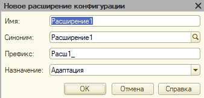

    В списке расширений появится новое пустое расширение. выбираем новое расширение путем однократного нажатия на строчку новым пустым расширением. Затем в панели управления жмем пункт "Конфигурация" и выбираем "Загрузить конфигурацию из файла"

    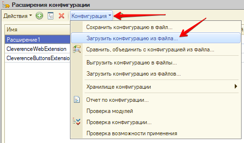

    Появится окно выбора файла расширения. Выбираем расширение с контролем остатка. Появится диалоговое окно, на котором соглашаемся продолжить:

    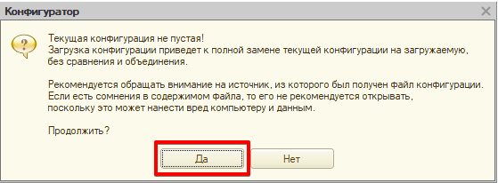

    Затем появится еще одно окошко, которое сообщит, что расширение загружено и требуется произвести обновление конфигурации БД:
    
    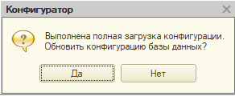

    **Всё! Расширение добавлено в базу.**
    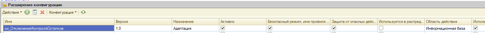

2. Добавление расширения в пользовательском режиме.
    
    Заходим в функции технического специалиста и ищем в разделе "Стандартные" пункт "Управление расширениями конфигурации"
    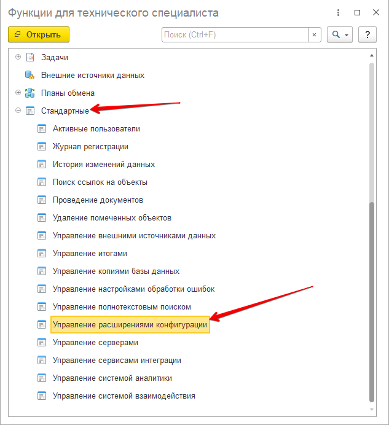

    Открываем консоль управления расширениями и через кнопку "добавить" добавляем наше расширение:
    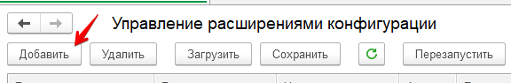

    **Всё! Расширение сразу появится списке расширений.**
    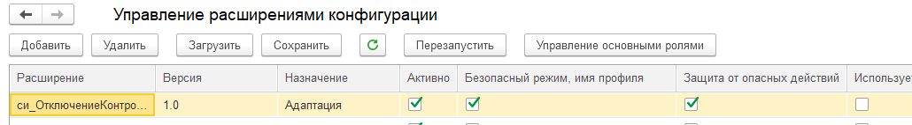

ВАЖНО!
После добавления расширения следует отключить "Безопасный режим" и "Защита от опасных действий", но сделать это следует только для расширения отключения контроля остатков!
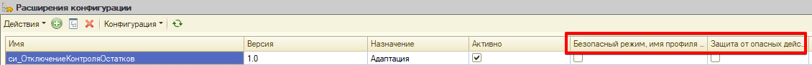

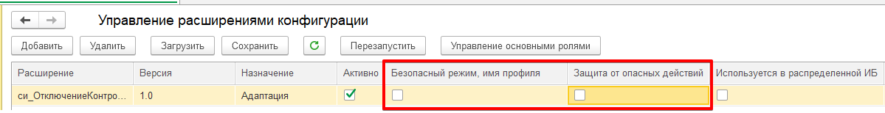

## Отключить контроль остатков на время сеанса согласно описаниям ниже:

Открыть настройки финансового результата и контролинга:
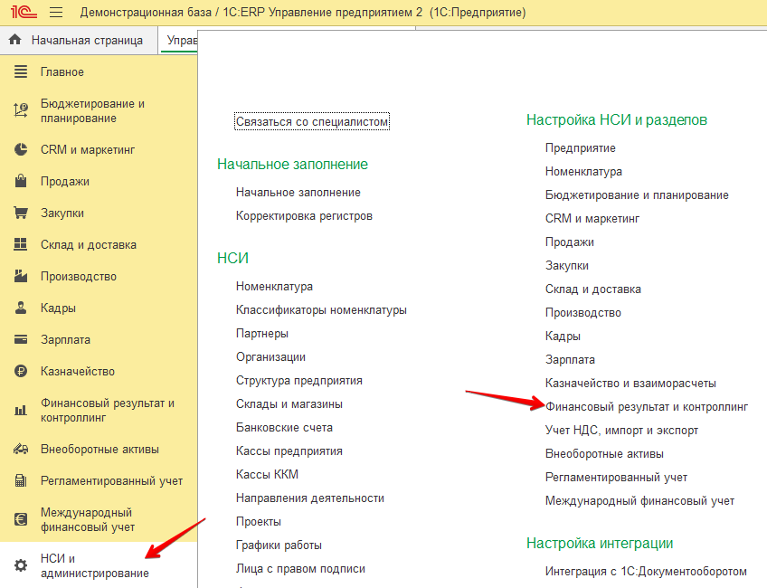

В появившейся вкладке раскрыть настройки "Учет товаров" и нажать на кнопку "Отключить контроль остатков (на время сеанса)"
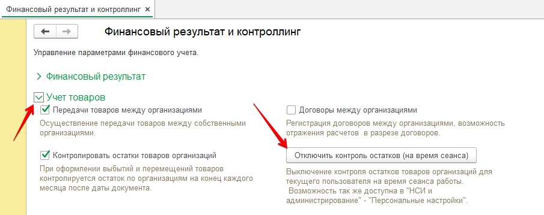

**ВСЁ! Теперь можно отменять проведение документов, где присутствуют товары и где требуется вести учет остатков.**
 
    Проверено на документах "Этапы производства" и "Расходный ордер на товары"
